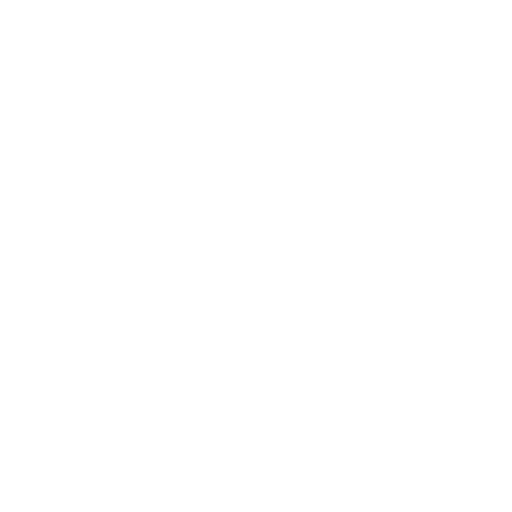

# 179io-MTT.github.io
<!DOCTYPE html>
<html lang="en">

<head>
    <meta charset="UTF-8">
    <meta http-equiv="X-UA-Compatible" content="IE=edge">
    <meta name="viewport" content="width=device-width, initial-scale=1.0">
    <meta name="google-site-verification" content="7oRb1mz6b36yH71bU4W9_-Q0RGdW2RhlUpDQ5Y3DGfw" />
    <meta name="facebook-domain-verification" content="mkiddxmoh9v84vek04vz472wd41n2f" />
    <meta name="msvalidate.01" content="719E848983AA37F4AA3A04B3616E1F9F" />
    <meta name="keywords" content="Mai Thanh Tùng (179io), 179io, 179io">
    <meta name="description" content="Mai Thanh Tùng (179io)">
    <meta name="author" content="Mai Thanh Tùng (179io)">
    <meta name="viewport" content="width=device-width, initial-scale=1.0">
    <meta name="geo.region" content="VN">
    <meta property="og:locale" content="vi_VN">
    <meta name="title" content="Mai Thanh Tùng (179io)">
    <meta name="description" content="Chào mừng bạn đến với Website của 179io.">
    <meta property="og:title" content="Mai Thanh Tùng (179io)" />
    <meta property="og:description" content="Chào mừng bạn" />
    <!-- Open Graph / Facebook -->
    <meta property="og:type" content="website">
    <meta property="og:url" content="https://github.com/179io-MTT/179.github.git">
    <meta property="og:title" content="Mai Thanh Tùng (179io)">
    <meta property="og:description" content="Chào mừng bạn đến với Website của 179io">
    <link rel="shortlink" href="https://github.com/179io-MTT/179.github.git">
    <meta name="twitter:site" content="@179io">
    <meta property="og:url" content="https://github.com/179io-MTT/179.github.git">
    <meta name="theme-color" content="#D0E6A5">
    <link rel="preconnect" href="https://fonts.googleapis.com">
    <link rel="preconnect" href="https://fonts.gstatic.com" crossorigin>
    <link href="https://fonts.googleapis.com/css2?family=Josefin+Sans:wght@300;400;600;700&display=swap" rel="stylesheet">
    <link rel="stylesheet" href="Untitled-1.css">
    <title>Mai Thanh Tùng</title>
<body class="scroll-smooth scrollbar">
    

        <header class="relative header">
            <nav class="navbar max-w-[90vw] lg:max-w-[70vw] w-full mx-auto lg:py-10 flex items-center justify-between py-8">
                

                    <a href="#" class="relative lg:text-3xl font-semibold text-white logo z-[5] text-2xl">
                        Thanh Tùng
                    </a>
                    

                

                <ul class="items-center hidden lg:flex gap-9">
                    <li><a href="https://github.com/179io-MTT/179.github.git" class="text-lg font-medium text-white uppercase text-opacity-80 hover:text-opacity-100">HOME</a></li>
                </ul>
                

                

            </nav>
            

                

                    

                    

                        <h1 class="text-3xl font-semibold leading-normal text-white lg:text-5xl">
                            Xin chào, mình là Thanh Tùng
                        </h1>
                        

                            Mình là người đam mê công nghệ thông tin. MìnH Đến Từ Phong Nha
                            Quảng Bình
                             Thành Phố Đồng Hới.
                        

                        

                            <a class="relative inline-flex items-center justify-center w-full px-10 py-4 text-base font-semibold text-white cursor-pointer font-mont rounded-xl button-effect bg-gradient-to-tr from-[#fc6c8f] to-[#ffb86c] sm:w-auto" href="https://github.com/179io-MTT/IPA-179io"
                                src="img/179.jpg" style="width: 125px; height: 125px" class="filter">
                            Thêm nguồn
                            </a>
                        

                    

                

                

                    
                

            

        </header>
        

            <h2 class="relative lg:text-5xl text-white after:absolute after:w-[70px] after:h-[4px] after:bg-gradient-to-tr from-[#a8ff78] to-[#78ffd6] after:bottom-[-7px] after:left-0 mb-9 z-10 after:z-[4] text-3xl title-content">
                IPA của 179io
            </h2>
            

                <a class="text-white bg-[#1f2937]rounded-3xl" href="https://www.facebook.com/52Hz179/" id="project-2">
                    
                    

                        <h4 class="text-3xl font-semibold">
                            IPA 179io
                        </h4>
                        

                            ĐANG PHÁT TRIỂN
                        

                    

                      </a>
            

             
        

            <h2 class="relative lg:text-5xl text-white after:absolute after:w-[70px] after:h-[4px] after:bg-gradient-to-tr from-[#a8ff78] to-[#78ffd6] after:bottom-[-7px] after:left-0 mb-9 z-10 after:z-[4] text-3xl title-content">
                Thông thạo S
            </h2>
            

                

                    
                

                

                    
                

            

        

        

            <h2 class="relative lg:text-5xl text-white after:absolute after:w-[70px] after:h-[4px] after:bg-gradient-to-tr from-[#a8ff78] to-[#78ffd6] after:bottom-[-7px] after:left-0 mb-9 z-10 after:z-[4] text-3xl title-content">
                Call Me
            </h2>
            

                

                    

                        <h2 class="text-3xl font-bold lg:text-left lg:text-5xl mb-7 name-contact">
                            Mai Thanh Tùng
                        </h2>
                        <ul class="">
                            <li class="flex items-center gap-4 item-contact-1">
                                <svg xmlns="http://www.w3.org/2000/svg" class="w-5 h-5" viewBox="0 0 20 20" fill="currentColor">
                                    <path fill-rule="evenodd" d="M14.243 5.757a6 6 0 10-.986 9.284 1 1 0 111.087 1.678A8 8 0 1118 10a3 3 0 01-4.8 2.401A4 4 0 1114 10a1 1 0 102 0c0-1.537-.586-3.07-1.757-4.243zM12 10a2 2 0 10-4 0 2 2 0 004 0z" clip-rule="evenodd" />
                                </svg>
                                
Chivasregal73@icloud.com

                            </li>
                            <li class="flex items-center gap-4 item-contact-2">
                                <svg xmlns="http://www.w3.org/2000/svg" class="w-5 h-5" viewBox="0 0 20 20" fill="currentColor">
                                    <path fill-rule="evenodd" d="M7 2a2 2 0 00-2 2v12a2 2 0 002 2h6a2 2 0 002-2V4a2 2 0 00-2-2H7zm3 14a1 1 0 100-2 1 1 0 000 2z" clip-rule="evenodd" />
                                </svg>
                                
+84 369.171.709

                            </li>
                        </ul>
                        <h3 class="my-5 font-semibold border-b-2 border-white desc-contact">
                            Bạn Có Thế Flow Tôi Bằng Các Trang Mạng Phía Dưới
                        </h3>
                        <ul class="flex items-center justify-center gap-10 lg:gap-5 lg:justify-start">
                            <li class="social-item-1"><a href="https://github.com/179io-MTT"><i class="text-3xl fab fa-github"></i></a></li>
                            <li class="social-item-2"><a href="https://www.facebook.com/52Hz179/"><i class="text-3xl fab fa-facebook"></i></a></li>
                            <li class="social-item-3"><a href="https://www.facebook.com/coffefin179/"><i class="text-3xl fab fa-fanpage"></i></a></li>
                        </ul>
                    

                    

                        
                    

                

            

        

        

            <svg xmlns="http://www.w3.org/2000/svg" class="w-5 h-5 fill-gray-500" viewBox="0 0 20 20" fill="currentColor">
                <path fill-rule="evenodd" d="M4.293 15.707a1 1 0 010-1.414l5-5a1 1 0 011.414 0l5 5a1 1 0 01-1.414 1.414L10 11.414l-4.293 4.293a1 1 0 01-1.414 0zm0-6a1 1 0 010-1.414l5-5a1 1 0 011.414 0l5 5a1 1 0 01-1.414 1.414L10 5.414 5.707 9.707a1 1 0 01-1.414 0z" clip-rule="evenodd" />
            </svg>
        

    

    

        <ul class="flex flex-col items-center justify-center gap-12 navbar-list">
            <li><a href="#" class="text-lg font-medium text-white uppercase text-opacity-80 hover:text-opacity-100 navbar-item">HOME</a></li>
            <li><a href="#Project" class="text-lg font-medium text-white uppercase text-opacity-80 hover:text-opacity-100 navbar-item">Cửa Hàng</a></li>
            <li><a href="#Skill" class="text-lg font-medium text-white uppercase text-opacity-80 hover:text-opacity-100 navbar-item">Beat Skill</a></li>
            <li><a href="#Contact" class="text-lg font-medium text-white uppercase text-opacity-80 hover:text-opacity-100 navbar-item">Call Me</a></li>
        </ul>
    

    <section class="bg-black bg-opacity-60 absolute z-[8] w-[110vw] h-[100vh] top-0 overlay lg:hidden hidden"></section>
    
    
    
</body>

</html>
ScrollReveal({
    distance: '50px',
    duration: 2500,
    delay: 500
});

ScrollReveal().reveal('#header-text, .title-content', {
    delay: 300,
    origin: 'left'
});
ScrollReveal().reveal('#header-image', {
    delay: 400,
    origin: 'right'
});
ScrollReveal().reveal('#header-btn', {
    delay: 300,
    origin: 'bottom'
});

ScrollReveal().reveal('#project-1', {
    delay: 300,
    origin: 'right'
});
ScrollReveal().reveal('#project-2', {
    delay: 300,
    origin: 'left'
});
ScrollReveal().reveal('#project-3', {
    delay: 300,
    origin: 'right'
});

ScrollReveal().reveal('.skill-item', {
    delay: 300,
    origin: 'bottom'
});

ScrollReveal().reveal('.name-contact, .avt-contact', {
    delay: 300,
    origin: 'bottom'
});
ScrollReveal().reveal('.item-contact-1', {
    delay: 400,
    origin: 'bottom'
});
ScrollReveal().reveal('.item-contact-2', {
    delay: 450,
    origin: 'bottom'
});
ScrollReveal().reveal('.desc-contact', {
    delay: 500,
    origin: 'left'
});
ScrollReveal().reveal('.social-item-1', {
    delay: 550,
    origin: 'bottom'
});
ScrollReveal().reveal('.social-item-2', {
    delay: 600,
    origin: 'bottom'
});
ScrollReveal().reveal('.social-item-3', {
    delay: 650,
    origin: 'bottom'
});

const menuMobileBtn = document.querySelector('.menu-mobile-btn');
const navbarMobile = document.querySelector('.navbar-mobile')
const overlay = document.querySelector('.overlay');
const navbarList = document.querySelector('.navbar-list');

isOpen = false;

menuMobileBtn.addEventListener('click', () => {
    if (!isOpen) {
        navbarMobile.classList.remove('hidden')
        overlay.classList.remove('hidden')
        isOpen = true;
        menuMobileBtn.innerHTML = `
            <svg xmlns="http://www.w3.org/2000/svg" class="h-9 w-9 fill-white" viewBox="0 0 20 20" fill="currentColor">
            <path fill-rule="evenodd" d="M4.293 4.293a1 1 0 011.414 0L10 8.586l4.293-4.293a1 1 0 111.414 1.414L11.414 10l4.293 4.293a1 1 0 01-1.414 1.414L10 11.414l-4.293 4.293a1 1 0 01-1.414-1.414L8.586 10 4.293 5.707a1 1 0 010-1.414z" clip-rule="evenodd" />
            </svg>
        `
    } else {
        navbarMobile.classList.add('hidden')
        overlay.classList.add('hidden')
        isOpen = false;
        menuMobileBtn.innerHTML = `
            <svg xmlns="http://www.w3.org/2000/svg" class="h-9 w-9 fill-white" viewBox="0 0 20 20" fill="currentColor">
            <path fill-rule="evenodd" d="M3 5a1 1 0 011-1h12a1 1 0 110 2H4a1 1 0 01-1-1zM3 10a1 1 0 011-1h12a1 1 0 110 2H4a1 1 0 01-1-1zM9 15a1 1 0 011-1h6a1 1 0 110 2h-6a1 1 0 01-1-1z" clip-rule="evenodd" />
            </svg>
        `
    }
})

navbarList.addEventListener('click', (e) => {
    const navbarItem = e.target.closest('.navbar-item');
    if (navbarItem) {
        navbarMobile.classList.add('hidden')
        overlay.classList.add('hidden')
        isOpen = false;
        menuMobileBtn.innerHTML = `
            <svg xmlns="http://www.w3.org/2000/svg" class="h-9 w-9 fill-white" viewBox="0 0 20 20" fill="currentColor">
            <path fill-rule="evenodd" d="M3 5a1 1 0 011-1h12a1 1 0 110 2H4a1 1 0 01-1-1zM3 10a1 1 0 011-1h12a1 1 0 110 2H4a1 1 0 01-1-1zM9 15a1 1 0 011-1h6a1 1 0 110 2h-6a1 1 0 01-1-1z" clip-rule="evenodd" />
            </svg>
        `
    }
})

var mybutton = document.getElementById("myBtn");

// When the user scrolls down 20px from the top of the document, show the button
window.onscroll = function() {
    scrollFunction()
};

function scrollFunction() {
    if (document.body.scrollTop > 20 || document.documentElement.scrollTop > 20) {
        mybutton.classList.remove('hidden');
        navbarMobile.classList.add('hidden')
        overlay.classList.add('hidden')
        isOpen = false;
        menuMobileBtn.innerHTML = `
            <svg xmlns="http://www.w3.org/2000/svg" class="h-9 w-9 fill-white" viewBox="0 0 20 20" fill="currentColor">
            <path fill-rule="evenodd" d="M3 5a1 1 0 011-1h12a1 1 0 110 2H4a1 1 0 01-1-1zM3 10a1 1 0 011-1h12a1 1 0 110 2H4a1 1 0 01-1-1zM9 15a1 1 0 011-1h6a1 1 0 110 2h-6a1 1 0 01-1-1z" clip-rule="evenodd" />
            </svg>
        `
    } else {
        mybutton.classList.add('hidden');
    }
}

// When the user clicks on the button, scroll to the top of the document
function topFunction() {
    document.body.scrollTop = 0;
    document.documentElement.scrollTop = 0;
}
*,
::before,
::after {
    box-sizing: border-box;
    border-width: 0;
    border-style: solid;
    border-color: #e5e7eb;
}

::before,
::after {
    --tw-content: '';
}

html {
    line-height: 1.5;
    -webkit-text-size-adjust: 100%;
    -moz-tab-size: 4;
    -o-tab-size: 4;
    tab-size: 4;
    font-family: 'Josefin Sans', sans-serif;
}

body {
    margin: 0;
    line-height: inherit;
}

hr {
    height: 0;
    color: inherit;
    border-top-width: 1px;
}

abbr:where([title]) {
    -webkit-text-decoration: underline dotted;
    text-decoration: underline dotted;
}

h1,
h2,
h3,
h4,
h5,
h6 {
    font-size: inherit;
    font-weight: inherit;
}

a {
    color: inherit;
    text-decoration: inherit;
}

b,
strong {
    font-weight: bolder;
}

code,
kbd,
samp,
pre {
    font-family: 'Josefin Sans', sans-serif;
    font-size: 1em;
}

small {
    font-size: 80%;
}

sub,
sup {
    font-size: 75%;
    line-height: 0;
    position: relative;
    vertical-align: baseline;
}

sub {
    bottom: -0.25em;
}

sup {
    top: -0.5em;
}

table {
    text-indent: 0;
    border-color: inherit;
    border-collapse: collapse;
}

button,
input,
optgroup,
select,
textarea {
    font-family: inherit;
    font-size: 100%;
    line-height: inherit;
    color: inherit;
    margin: 0;
    padding: 0;
}

button,
select {
    text-transform: none;
}

button,
[type='button'],
[type='reset'],
[type='submit'] {
    -webkit-appearance: button;
    background-color: transparent;
    background-image: none;
}

:-moz-focusring {
    outline: auto;
}

:-moz-ui-invalid {
    box-shadow: none;
}

progress {
    vertical-align: baseline;
}

::-webkit-inner-spin-button,
::-webkit-outer-spin-button {
    height: auto;
}

[type='search'] {
    -webkit-appearance: textfield;
    outline-offset: -2px;
}

::-webkit-search-decoration {
    -webkit-appearance: none;
}

::-webkit-file-upload-button {
    -webkit-appearance: button;
    font: inherit;
}

summary {
    display: list-item;
}

blockquote,
dl,
dd,
h1,
h2,
h3,
h4,
h5,
h6,
hr,
figure,
p,
pre {
    margin: 0;
}

fieldset {
    margin: 0;
    padding: 0;
}

legend {
    padding: 0;
}

ol,
ul,
menu {
    list-style: none;
    margin: 0;
    padding: 0;
}

textarea {
    resize: vertical;
}

input::-moz-placeholder,
textarea::-moz-placeholder {
    opacity: 1;
    color: #9ca3af;
}

input:-ms-input-placeholder,
textarea:-ms-input-placeholder {
    opacity: 1;
    color: #9ca3af;
}

input::placeholder,
textarea::placeholder {
    opacity: 1;
    color: #9ca3af;
}

button,
[role="button"] {
    cursor: pointer;
}

:disabled {
    cursor: default;
}

img,
svg,
video,
canvas,
audio,
iframe,
embed,
object {
    display: block;
    vertical-align: middle;
}

img,
video {
    max-width: 100%;
    height: auto;
}

[hidden] {
    display: none;
}

html {
    font-family: 'Josefin Sans', sans-serif;
    scroll-behavior: smooth;
}

*,
::before,
::after {
    --tw-translate-x: 0;
    --tw-translate-y: 0;
    --tw-rotate: 0;
    --tw-skew-x: 0;
    --tw-skew-y: 0;
    --tw-scale-x: 1;
    --tw-scale-y: 1;
    --tw-pan-x: ;
    --tw-pan-y: ;
    --tw-pinch-zoom: ;
    --tw-scroll-snap-strictness: proximity;
    --tw-ordinal: ;
    --tw-slashed-zero: ;
    --tw-numeric-figure: ;
    --tw-numeric-spacing: ;
    --tw-numeric-fraction: ;
    --tw-ring-inset: ;
    --tw-ring-offset-width: 0px;
    --tw-ring-offset-color: #fff;
    --tw-ring-color: rgba(7, 122, 51, 0.5);
    --tw-ring-offset-shadow: 0 0 #0000;
    --tw-ring-shadow: 0 0 #0000;
    --tw-shadow: 0 0 #0000;
    --tw-shadow-colored: 0 0 #0000;
    --tw-blur: ;
    --tw-brightness: ;
    --tw-contrast: ;
    --tw-grayscale: ;
    --tw-hue-rotate: ;
    --tw-invert: ;
    --tw-saturate: ;
    --tw-sepia: ;
    --tw-drop-shadow: ;
    --tw-backdrop-blur: ;
    --tw-backdrop-brightness: ;
    --tw-backdrop-contrast: ;
    --tw-backdrop-grayscale: ;
    --tw-backdrop-hue-rotate: ;
    --tw-backdrop-invert: ;
    --tw-backdrop-opacity: ;
    --tw-backdrop-saturate: ;
    --tw-backdrop-sepia: ;
}

.container {
    width: 100%;
}

@media (min-width: 640px) {
    .container {
        max-width: 640px;
    }
}

@media (min-width: 768px) {
    .container {
        max-width: 768px;
    }
}

@media (min-width: 1024px) {
    .container {
        max-width: 1024px;
    }
}

@media (min-width: 1280px) {
    .container {
        max-width: 1280px;
    }
}

@media (min-width: 1536px) {
    .container {
        max-width: 1536px;
    }
}

.sr-only {
    position: absolute;
    width: 1px;
    height: 1px;
    padding: 0;
    margin: -1px;
    overflow: hidden;
    clip: rect(0, 0, 0, 0);
    white-space: nowrap;
    border-width: 0;
}

.not-sr-only {
    position: static;
    width: auto;
    height: auto;
    padding: 0;
    margin: 0;
    overflow: visible;
    clip: auto;
    white-space: normal;
}

.pointer-events-none {
    pointer-events: none;
}

.pointer-events-auto {
    pointer-events: auto;
}

.visible {
    visibility: visible;
}

.invisible {
    visibility: hidden;
}

.static {
    position: static;
}

.fixed {
    position: fixed;
}

.absolute {
    position: absolute;
}

.relative {
    position: relative;
}

.sticky {
    position: -webkit-sticky;
    position: sticky;
}

.-inset-1 {
    top: -0.25rem;
    right: -0.25rem;
    bottom: -0.25rem;
    left: -0.25rem;
}

.top-\[-5px\] {
    top: -5px;
}

.right-\[-10px\] {
    right: -10px;
}

.left-10 {
    left: 2.5rem;
}

.top-10 {
    top: 2.5rem;
}

.bottom-4 {
    bottom: 1rem;
}

.right-4 {
    right: 1rem;
}

.top-0 {
    top: 0px;
}

.left-0 {
    left: 0px;
}

.isolate {
    isolation: isolate;
}

.isolation-auto {
    isolation: auto;
}

.z-\[5\] {
    z-index: 5;
}

.z-\[1\] {
    z-index: 1;
}

.z-20 {
    z-index: 20;
}

.z-10 {
    z-index: 10;
}

.z-\[8\] {
    z-index: 8;
}

.float-right {
    float: right;
}

.float-left {
    float: left;
}

.float-none {
    float: none;
}

.clear-left {
    clear: left;
}

.clear-right {
    clear: right;
}

.clear-both {
    clear: both;
}

.clear-none {
    clear: none;
}

.mx-auto {
    margin-left: auto;
    margin-right: auto;
}

.my-5 {
    margin-top: 1.25rem;
    margin-bottom: 1.25rem;
}

.mt-6 {
    margin-top: 1.5rem;
}

.mb-9 {
    margin-bottom: 2.25rem;
}

.mt-5 {
    margin-top: 1.25rem;
}

.mb-7 {
    margin-bottom: 1.75rem;
}

.mt-2 {
    margin-top: 0.5rem;
}

.box-border {
    box-sizing: border-box;
}

.box-content {
    box-sizing: content-box;
}

.block {
    display: block;
}

.inline-block {
    display: inline-block;
}

.inline {
    display: inline;
}

.flex {
    display: flex;
}

.inline-flex {
    display: inline-flex;
}

.table {
    display: table;
}

.inline-table {
    display: inline-table;
}

.table-caption {
    display: table-caption;
}

.table-cell {
    display: table-cell;
}

.table-column {
    display: table-column;
}

.table-column-group {
    display: table-column-group;
}

.table-footer-group {
    display: table-footer-group;
}

.table-header-group {
    display: table-header-group;
}

.table-row-group {
    display: table-row-group;
}

.table-row {
    display: table-row;
}

.flow-root {
    display: flow-root;
}

.grid {
    display: grid;
}

.inline-grid {
    display: inline-grid;
}

.contents {
    display: contents;
}

.list-item {
    display: list-item;
}

.hidden {
    display: none;
}

.h-\[46px\] {
    height: 46px;
}

.h-9 {
    height: 2.25rem;
}

.h-20 {
    height: 5rem;
}

.h-5 {
    height: 1.25rem;
}

.h-\[60px\] {
    height: 60px;
}

.h-\[100vh\] {
    height: 100vh;
}

.h-\[calc\(100\%-theme\(\'spacing\.1\'\)\)\] {
 height: calc(100% - 0.25rem);
}

.h-\[calc\(100\%-theme\(\"spacing\.1\"\)\)\] {
 height: calc(100% - 0.25rem);
}

.w-full {
    width: 100%;
}

.w-\[46px\] {
    width: 46px;
}

.w-9 {
    width: 2.25rem;
}

.w-20 {
    width: 5rem;
}

.w-\[150px\] {
    width: 150px;
}

.w-\[90vw\] {
    width: 90vw;
}

.w-5 {
    width: 1.25rem;
}

.w-\[200px\] {
    width: 200px;
}

.w-\[60px\] {
    width: 60px;
}

.w-\[70vw\] {
    width: 70vw;
}

.w-\[110vw\] {
    width: 110vw;
}

.max-w-\[90vw\] {
    max-width: 90vw;
}

.max-w-\[250px\] {
    max-width: 250px;
}

.flex-shrink {
    flex-shrink: 1;
}

.shrink {
    flex-shrink: 1;
}

.flex-grow {
    flex-grow: 1;
}

.grow {
    flex-grow: 1;
}

.table-auto {
    table-layout: auto;
}

.table-fixed {
    table-layout: fixed;
}

.border-collapse {
    border-collapse: collapse;
}

.border-separate {
    border-collapse: separate;
}

.origin-bottom {
    transform-origin: bottom;
}

.-rotate-12 {
    --tw-rotate: -12deg;
    transform: translate(var(--tw-translate-x), var(--tw-translate-y)) rotate(var(--tw-rotate)) skewX(var(--tw-skew-x)) skewY(var(--tw-skew-y)) scaleX(var(--tw-scale-x)) scaleY(var(--tw-scale-y));
}

.scale-\[3\] {
    --tw-scale-x: 3;
    --tw-scale-y: 3;
    transform: translate(var(--tw-translate-x), var(--tw-translate-y)) rotate(var(--tw-rotate)) skewX(var(--tw-skew-x)) skewY(var(--tw-skew-y)) scaleX(var(--tw-scale-x)) scaleY(var(--tw-scale-y));
}

.transform {
    transform: translate(var(--tw-translate-x), var(--tw-translate-y)) rotate(var(--tw-rotate)) skewX(var(--tw-skew-x)) skewY(var(--tw-skew-y)) scaleX(var(--tw-scale-x)) scaleY(var(--tw-scale-y));
}

.\ !transform {
    transform: translate(var(--tw-translate-x), var(--tw-translate-y)) rotate(var(--tw-rotate)) skewX(var(--tw-skew-x)) skewY(var(--tw-skew-y)) scaleX(var(--tw-scale-x)) scaleY(var(--tw-scale-y)) !important;
}

.transform-cpu {
    transform: translate(var(--tw-translate-x), var(--tw-translate-y)) rotate(var(--tw-rotate)) skewX(var(--tw-skew-x)) skewY(var(--tw-skew-y)) scaleX(var(--tw-scale-x)) scaleY(var(--tw-scale-y));
}

.transform-gpu {
    transform: translate3d(var(--tw-translate-x), var(--tw-translate-y), 0) rotate(var(--tw-rotate)) skewX(var(--tw-skew-x)) skewY(var(--tw-skew-y)) scaleX(var(--tw-scale-x)) scaleY(var(--tw-scale-y));
}

.transform-none {
    transform: none;
}

.cursor-pointer {
    cursor: pointer;
}

.touch-auto {
    touch-action: auto;
}

.touch-none {
    touch-action: none;
}

.touch-pan-x {
    --tw-pan-x: pan-x;
    touch-action: var(--tw-pan-x) var(--tw-pan-y) var(--tw-pinch-zoom);
}

.touch-pan-left {
    --tw-pan-x: pan-left;
    touch-action: var(--tw-pan-x) var(--tw-pan-y) var(--tw-pinch-zoom);
}

.touch-pan-right {
    --tw-pan-x: pan-right;
    touch-action: var(--tw-pan-x) var(--tw-pan-y) var(--tw-pinch-zoom);
}

.touch-pan-y {
    --tw-pan-y: pan-y;
    touch-action: var(--tw-pan-x) var(--tw-pan-y) var(--tw-pinch-zoom);
}

.touch-pan-up {
    --tw-pan-y: pan-up;
    touch-action: var(--tw-pan-x) var(--tw-pan-y) var(--tw-pinch-zoom);
}

.touch-pan-down {
    --tw-pan-y: pan-down;
    touch-action: var(--tw-pan-x) var(--tw-pan-y) var(--tw-pinch-zoom);
}

.touch-pinch-zoom {
    --tw-pinch-zoom: pinch-zoom;
    touch-action: var(--tw-pan-x) var(--tw-pan-y) var(--tw-pinch-zoom);
}

.touch-manipulation {
    touch-action: manipulation;
}

.select-none {
    -webkit-user-select: none;
    -moz-user-select: none;
    -ms-user-select: none;
    user-select: none;
}

.select-text {
    -webkit-user-select: text;
    -moz-user-select: text;
    -ms-user-select: text;
    user-select: text;
}

.select-all {
    -webkit-user-select: all;
    -moz-user-select: all;
    user-select: all;
}

.select-auto {
    -webkit-user-select: auto;
    -moz-user-select: auto;
    -ms-user-select: auto;
    user-select: auto;
}

.resize-none {
    resize: none;
}

.resize-y {
    resize: vertical;
}

.resize-x {
    resize: horizontal;
}

.resize {
    resize: both;
}

.snap-none {
    -ms-scroll-snap-type: none;
    scroll-snap-type: none;
}

.snap-x {
    -ms-scroll-snap-type: x var(--tw-scroll-snap-strictness);
    scroll-snap-type: x var(--tw-scroll-snap-strictness);
}

.snap-y {
    -ms-scroll-snap-type: y var(--tw-scroll-snap-strictness);
    scroll-snap-type: y var(--tw-scroll-snap-strictness);
}

.snap-both {
    -ms-scroll-snap-type: both var(--tw-scroll-snap-strictness);
    scroll-snap-type: both var(--tw-scroll-snap-strictness);
}

.snap-mandatory {
    --tw-scroll-snap-strictness: mandatory;
}

.snap-proximity {
    --tw-scroll-snap-strictness: proximity;
}

.snap-start {
    scroll-snap-align: start;
}

.snap-end {
    scroll-snap-align: end;
}

.snap-center {
    scroll-snap-align: center;
}

.snap-align-none {
    scroll-snap-align: none;
}

.snap-normal {
    scroll-snap-stop: normal;
}

.snap-always {
    scroll-snap-stop: always;
}

.list-inside {
    list-style-position: inside;
}

.list-outside {
    list-style-position: outside;
}

.appearance-none {
    -webkit-appearance: none;
    -moz-appearance: none;
    appearance: none;
}

.break-before-auto {
    -moz-column-break-before: auto;
    break-before: auto;
}

.break-before-avoid {
    -moz-column-break-before: avoid;
    break-before: avoid;
}

.break-before-all {
    -moz-column-break-before: all;
    break-before: all;
}

.break-before-avoid-page {
    -moz-column-break-before: avoid;
    break-before: avoid-page;
}

.break-before-page {
    -moz-column-break-before: page;
    break-before: page;
}

.break-before-left {
    -moz-column-break-before: left;
    break-before: left;
}

.break-before-right {
    -moz-column-break-before: right;
    break-before: right;
}

.break-before-column {
    -moz-column-break-before: column;
    break-before: column;
}

.break-inside-auto {
    -moz-column-break-inside: auto;
    break-inside: auto;
}

.break-inside-avoid {
    -moz-column-break-inside: avoid;
    break-inside: avoid;
}

.break-inside-avoid-page {
    break-inside: avoid-page;
}

.break-inside-avoid-column {
    -moz-column-break-inside: avoid;
    break-inside: avoid-column;
}

.break-after-auto {
    -moz-column-break-after: auto;
    break-after: auto;
}

.break-after-avoid {
    -moz-column-break-after: avoid;
    break-after: avoid;
}

.break-after-all {
    -moz-column-break-after: all;
    break-after: all;
}

.break-after-avoid-page {
    -moz-column-break-after: avoid;
    break-after: avoid-page;
}

.break-after-page {
    -moz-column-break-after: page;
    break-after: page;
}

.break-after-left {
    -moz-column-break-after: left;
    break-after: left;
}

.break-after-right {
    -moz-column-break-after: right;
    break-after: right;
}

.break-after-column {
    -moz-column-break-after: column;
    break-after: column;
}

.grid-flow-row {
    grid-auto-flow: row;
}

.grid-flow-col {
    grid-auto-flow: column;
}

.grid-flow-row-dense {
    grid-auto-flow: row dense;
}

.grid-flow-col-dense {
    grid-auto-flow: column dense;
}

.flex-row {
    flex-direction: row;
}

.flex-row-reverse {
    flex-direction: row-reverse;
}

.flex-col {
    flex-direction: column;
}

.flex-col-reverse {
    flex-direction: column-reverse;
}

.flex-wrap {
    flex-wrap: wrap;
}

.flex-wrap-reverse {
    flex-wrap: wrap-reverse;
}

.flex-nowrap {
    flex-wrap: nowrap;
}

.place-content-center {
    place-content: center;
}

.place-content-start {
    place-content: start;
}

.place-content-end {
    place-content: end;
}

.place-content-between {
    place-content: space-between;
}

.place-content-around {
    place-content: space-around;
}

.place-content-evenly {
    place-content: space-evenly;
}

.place-content-stretch {
    place-content: stretch;
}

.place-items-start {
    place-items: start;
}

.place-items-end {
    place-items: end;
}

.place-items-center {
    place-items: center;
}

.place-items-stretch {
    place-items: stretch;
}

.content-center {
    align-content: center;
}

.content-start {
    align-content: flex-start;
}

.content-end {
    align-content: flex-end;
}

.content-between {
    align-content: space-between;
}

.content-around {
    align-content: space-around;
}

.content-evenly {
    align-content: space-evenly;
}

.items-start {
    align-items: flex-start;
}

.items-end {
    align-items: flex-end;
}

.items-center {
    align-items: center;
}

.items-baseline {
    align-items: baseline;
}

.items-stretch {
    align-items: stretch;
}

.justify-start {
    justify-content: flex-start;
}

.justify-end {
    justify-content: flex-end;
}

.justify-center {
    justify-content: center;
}

.justify-between {
    justify-content: space-between;
}

.justify-around {
    justify-content: space-around;
}

.justify-evenly {
    justify-content: space-evenly;
}

.justify-items-start {
    justify-items: start;
}

.justify-items-end {
    justify-items: end;
}

.justify-items-center {
    justify-items: center;
}

.justify-items-stretch {
    justify-items: stretch;
}

.gap-9 {
    gap: 2.25rem;
}

.gap-5 {
    gap: 1.25rem;
}

.gap-3 {
    gap: 0.75rem;
}

.gap-4 {
    gap: 1rem;
}

.gap-10 {
    gap: 2.5rem;
}

.gap-12 {
    gap: 3rem;
}

.space-y-reverse > :not([hidden]) ~ :not([hidden]) {
    --tw-space-y-reverse: 1;
}

.space-x-reverse > :not([hidden]) ~ :not([hidden]) {
    --tw-space-x-reverse: 1;
}

.divide-x > :not([hidden]) ~ :not([hidden]) {
    --tw-divide-x-reverse: 0;
    border-right-width: calc(1px * var(--tw-divide-x-reverse));
    border-left-width: calc(1px * calc(1 - var(--tw-divide-x-reverse)));
}

.divide-y > :not([hidden]) ~ :not([hidden]) {
    --tw-divide-y-reverse: 0;
    border-top-width: calc(1px * calc(1 - var(--tw-divide-y-reverse)));
    border-bottom-width: calc(1px * var(--tw-divide-y-reverse));
}

.divide-y-reverse > :not([hidden]) ~ :not([hidden]) {
    --tw-divide-y-reverse: 1;
}

.divide-x-reverse > :not([hidden]) ~ :not([hidden]) {
    --tw-divide-x-reverse: 1;
}

.divide-solid > :not([hidden]) ~ :not([hidden]) {
    border-style: solid;
}

.divide-dashed > :not([hidden]) ~ :not([hidden]) {
    border-style: dashed;
}

.divide-dotted > :not([hidden]) ~ :not([hidden]) {
    border-style: dotted;
}

.divide-double > :not([hidden]) ~ :not([hidden]) {
    border-style: double;
}

.divide-none > :not([hidden]) ~ :not([hidden]) {
    border-style: none;
}

.place-self-auto {
    place-self: auto;
}

.place-self-start {
    place-self: start;
}

.place-self-end {
    place-self: end;
}

.place-self-center {
    place-self: center;
}

.place-self-stretch {
    place-self: stretch;
}

.self-auto {
    align-self: auto;
}

.self-start {
    align-self: flex-start;
}

.self-end {
    align-self: flex-end;
}

.self-center {
    align-self: center;
}

.self-stretch {
    align-self: stretch;
}

.self-baseline {
    align-self: baseline;
}

.justify-self-auto {
    justify-self: auto;
}

.justify-self-start {
    justify-self: start;
}

.justify-self-end {
    justify-self: end;
}

.justify-self-center {
    justify-self: center;
}

.justify-self-stretch {
    justify-self: stretch;
}

.overflow-auto {
    overflow: auto;
}

.overflow-hidden {
    overflow: hidden;
}

.overflow-clip {
    overflow: clip;
}

.overflow-visible {
    overflow: visible;
}

.overflow-scroll {
    overflow: scroll;
}

.overflow-x-auto {
    overflow-x: auto;
}

.overflow-y-auto {
    overflow-y: auto;
}

.overflow-x-hidden {
    overflow-x: hidden;
}

.overflow-y-hidden {
    overflow-y: hidden;
}

.overflow-x-clip {
    overflow-x: clip;
}

.overflow-y-clip {
    overflow-y: clip;
}

.overflow-x-visible {
    overflow-x: visible;
}

.overflow-y-visible {
    overflow-y: visible;
}

.overflow-x-scroll {
    overflow-x: scroll;
}

.overflow-y-scroll {
    overflow-y: scroll;
}

.overscroll-auto {
    -ms-scroll-chaining: chained;
    overscroll-behavior: auto;
}

.overscroll-contain {
    -ms-scroll-chaining: none;
    overscroll-behavior: contain;
}

.overscroll-none {
    -ms-scroll-chaining: none;
    overscroll-behavior: none;
}

.overscroll-y-auto {
    overscroll-behavior-y: auto;
}

.overscroll-y-contain {
    overscroll-behavior-y: contain;
}

.overscroll-y-none {
    overscroll-behavior-y: none;
}

.overscroll-x-auto {
    overscroll-behavior-x: auto;
}

.overscroll-x-contain {
    overscroll-behavior-x: contain;
}

.overscroll-x-none {
    overscroll-behavior-x: none;
}

.scroll-auto {
    scroll-behavior: auto;
}

.scroll-smooth {
    scroll-behavior: smooth;
}

.truncate {
    overflow: hidden;
    text-overflow: ellipsis;
    white-space: nowrap;
}

.overflow-ellipsis {
    text-overflow: ellipsis;
}

.text-ellipsis {
    text-overflow: ellipsis;
}

.text-clip {
    text-overflow: clip;
}

.whitespace-normal {
    white-space: normal;
}

.whitespace-nowrap {
    white-space: nowrap;
}

.whitespace-pre {
    white-space: pre;
}

.whitespace-pre-line {
    white-space: pre-line;
}

.whitespace-pre-wrap {
    white-space: pre-wrap;
}

.break-normal {
    overflow-wrap: normal;
    word-break: normal;
}

.break-words {
    overflow-wrap: break-word;
}

.break-all {
    word-break: break-all;
}

.rounded-xl {
    border-radius: 0.75rem;
}

.rounded-full {
    border-radius: 9999px;
}

.rounded-\[40px\] {
    border-radius: 40px;
}

.rounded-3xl {
    border-radius: 1.5rem;
}

.rounded-2xl {
    border-radius: 1rem;
}

.rounded {
    border-radius: 0.25rem;
}

.rounded-t-3xl {
    border-top-left-radius: 1.5rem;
    border-top-right-radius: 1.5rem;
}

.rounded-b-3xl {
    border-bottom-right-radius: 1.5rem;
    border-bottom-left-radius: 1.5rem;
}

.rounded-t {
    border-top-left-radius: 0.25rem;
    border-top-right-radius: 0.25rem;
}

.rounded-r {
    border-top-right-radius: 0.25rem;
    border-bottom-right-radius: 0.25rem;
}

.rounded-b {
    border-bottom-right-radius: 0.25rem;
    border-bottom-left-radius: 0.25rem;
}

.rounded-l {
    border-top-left-radius: 0.25rem;
    border-bottom-left-radius: 0.25rem;
}

.rounded-tl {
    border-top-left-radius: 0.25rem;
}

.rounded-tr {
    border-top-right-radius: 0.25rem;
}

.rounded-br {
    border-bottom-right-radius: 0.25rem;
}

.rounded-bl {
    border-bottom-left-radius: 0.25rem;
}

.border-2 {
    border-width: 2px;
}

.border {
    border-width: 1px;
}

.border-x {
    border-left-width: 1px;
    border-right-width: 1px;
}

.border-y {
    border-top-width: 1px;
    border-bottom-width: 1px;
}

.border-b-2 {
    border-bottom-width: 2px;
}

.border-t {
    border-top-width: 1px;
}

.border-r {
    border-right-width: 1px;
}

.border-b {
    border-bottom-width: 1px;
}

.border-l {
    border-left-width: 1px;
}

.border-solid {
    border-style: solid;
}

.border-dashed {
    border-style: dashed;
}

.border-dotted {
    border-style: dotted;
}

.border-double {
    border-style: double;
}

.border-hidden {
    border-style: hidden;
}

.border-none {
    border-style: none;
}

.border-\[\#0f172a\] {
    --tw-border-opacity: 1;
    border-color: rgb(15 23 42 / var(--tw-border-opacity));
}

.border-white {
    --tw-border-opacity: 1;
    border-color: rgb(255 255 255 / var(--tw-border-opacity));
}

.bg-\[\#0f172a\] {
    --tw-bg-opacity: 1;
    background-color: rgb(15 23 42 / var(--tw-bg-opacity));
}

.bg-\[\#6a5af9\] {
    --tw-bg-opacity: 1;
    background-color: rgb(106 90 249 / var(--tw-bg-opacity));
}

.bg-\[\#1f2937\] {
    --tw-bg-opacity: 1;
    background-color: rgb(31 41 55 / var(--tw-bg-opacity));
}

.bg-\[\#242b42\] {
    --tw-bg-opacity: 1;
    background-color: rgb(36 43 66 / var(--tw-bg-opacity));
}

.bg-black {
    --tw-bg-opacity: 1;
    background-color: rgb(0 0 0 / var(--tw-bg-opacity));
}

.bg-\[rgb\(255\2c 0\2c 0\)\] {
    --tw-bg-opacity: 1;
    background-color: rgb(255 0 0 / var(--tw-bg-opacity));
}

.bg-opacity-50 {
    --tw-bg-opacity: 0.5;
}

.bg-opacity-60 {
    --tw-bg-opacity: 0.6;
}

.bg-gradient-to-br {
    background-image: linear-gradient(to bottom right, var(--tw-gradient-stops));
}

.bg-gradient-to-r {
    background-image: linear-gradient(to right, var(--tw-gradient-stops));
}

.bg-gradient-to-tr {
    background-image: linear-gradient(to top right, var(--tw-gradient-stops));
}

.bg-\[url\(\'\.\.\.\'\)\] {
 background-image: url('...');
}

.bg-\[url\(\"\.\.\.\"\)\] {
 background-image: url("...");
}

.bg-\[url\(\'\.\.\.\'\)\2c url\(\'\.\.\.\'\)\] {
 background-image: url('...'), url('...');
}

.bg-\[url\(\"\.\.\.\"\)\2c url\(\"\.\.\.\"\)\] {
 background-image: url("..."), url("...");
}

.from-\[\#4AC29A\] {
    --tw-gradient-from: #4AC29A;
    --tw-gradient-stops: var(--tw-gradient-from), var(--tw-gradient-to, rgb(74 194 154 / 0));
}

.from-\[\#B3FFAB\] {
    --tw-gradient-from: #B3FFAB;
    --tw-gradient-stops: var(--tw-gradient-from), var(--tw-gradient-to, rgb(179 255 171 / 0));
}

.from-\[\#fc6c8f\] {
    --tw-gradient-from: #fc6c8f;
    --tw-gradient-stops: var(--tw-gradient-from), var(--tw-gradient-to, rgb(252 108 143 / 0));
}

.from-\[\#a8ff78\] {
    --tw-gradient-from: #a8ff78;
    --tw-gradient-stops: var(--tw-gradient-from), var(--tw-gradient-to, rgb(168 255 120 / 0));
}

.to-\[\#BDFFF3\] {
    --tw-gradient-to: #BDFFF3;
}

.to-\[\#12FFF7\] {
    --tw-gradient-to: #12FFF7;
}

.to-\[\#ffb86c\] {
    --tw-gradient-to: #ffb86c;
}

.to-\[\#78ffd6\] {
    --tw-gradient-to: #78ffd6;
}

.decoration-slice {
    -webkit-box-decoration-break: slice;
    box-decoration-break: slice;
}

.decoration-clone {
    -webkit-box-decoration-break: clone;
    box-decoration-break: clone;
}

.box-decoration-slice {
    -webkit-box-decoration-break: slice;
    box-decoration-break: slice;
}

.box-decoration-clone {
    -webkit-box-decoration-break: clone;
    box-decoration-break: clone;
}

.bg-fixed {
    background-attachment: fixed;
}

.bg-local {
    background-attachment: local;
}

.bg-scroll {
    background-attachment: scroll;
}

.bg-clip-border {
    background-clip: border-box;
}

.bg-clip-padding {
    background-clip: padding-box;
}

.bg-clip-content {
    background-clip: content-box;
}

.bg-clip-text {
    -webkit-background-clip: text;
    background-clip: text;
}

.bg-repeat {
    background-repeat: repeat;
}

.bg-no-repeat {
    background-repeat: no-repeat;
}

.bg-repeat-x {
    background-repeat: repeat-x;
}

.bg-repeat-y {
    background-repeat: repeat-y;
}

.bg-repeat-round {
    background-repeat: round;
}

.bg-repeat-space {
    background-repeat: space;
}

.bg-origin-border {
    background-origin: border-box;
}

.bg-origin-padding {
    background-origin: padding-box;
}

.bg-origin-content {
    background-origin: content-box;
}

.fill-white {
    fill: #fff;
}

.fill-gray-500 {
    fill: #6b7280;
}

.fill-\[\#bada55\] {
    fill: #bada55;
}

.fill-\[\#bada55\]\/50 {
    fill: rgb(186 218 85 / 0.5);
}

.object-contain {
    -o-object-fit: contain;
    object-fit: contain;
}

.object-cover {
    -o-object-fit: cover;
    object-fit: cover;
}

.object-fill {
    -o-object-fit: fill;
    object-fit: fill;
}

.object-none {
    -o-object-fit: none;
    object-fit: none;
}

.object-scale-down {
    -o-object-fit: scale-down;
    object-fit: scale-down;
}

.p-4 {
    padding: 1rem;
}

.p-6 {
    padding: 1.5rem;
}

.py-8 {
    padding-top: 2rem;
    padding-bottom: 2rem;
}

.py-10 {
    padding-top: 2.5rem;
    padding-bottom: 2.5rem;
}

.py-6 {
    padding-top: 1.5rem;
    padding-bottom: 1.5rem;
}

.px-10 {
    padding-left: 2.5rem;
    padding-right: 2.5rem;
}

.py-4 {
    padding-top: 1rem;
    padding-bottom: 1rem;
}

.py-3 {
    padding-top: 0.75rem;
    padding-bottom: 0.75rem;
}

.py-5 {
    padding-top: 1.25rem;
    padding-bottom: 1.25rem;
}

.px-8 {
    padding-left: 2rem;
    padding-right: 2rem;
}

.py-11 {
    padding-top: 2.75rem;
    padding-bottom: 2.75rem;
}

.px-1\.5 {
    padding-left: 0.375rem;
    padding-right: 0.375rem;
}

.px-1 {
    padding-left: 0.25rem;
    padding-right: 0.25rem;
}

.pb-10 {
    padding-bottom: 2.5rem;
}

.pb-\[45px\] {
    padding-bottom: 45px;
}

.text-left {
    text-align: left;
}

.text-center {
    text-align: center;
}

.text-right {
    text-align: right;
}

.text-justify {
    text-align: justify;
}

.align-baseline {
    vertical-align: baseline;
}

.align-top {
    vertical-align: top;
}

.align-middle {
    vertical-align: middle;
}

.align-bottom {
    vertical-align: bottom;
}

.align-text-top {
    vertical-align: text-top;
}

.align-text-bottom {
    vertical-align: text-bottom;
}

.align-sub {
    vertical-align: sub;
}

.align-super {
    vertical-align: super;
}

.font-\[\'some_font\'\2c sans-serif\] {
 font-family: 'Josefin Sans', sans-serif;
}

.font-\[\"some_font\"\2c sans-serif\] {
 font-family: 'Josefin Sans', sans-serif;
}

.text-2xl {
    font-size: 1.5rem;
    line-height: 2rem;
}

.text-lg {
    font-size: 1.125rem;
    line-height: 1.75rem;
}

.text-3xl {
    font-size: 1.875rem;
    line-height: 2.25rem;
}

.text-4xl {
    font-size: 2.25rem;
    line-height: 2.5rem;
}

.text-sm {
    font-size: 0.875rem;
    line-height: 1.25rem;
}

.text-base {
    font-size: 1rem;
    line-height: 1.5rem;
}

.font-semibold {
    font-weight: 600;
}

.font-medium {
    font-weight: 500;
}

.font-bold {
    font-weight: 700;
}

.uppercase {
    text-transform: uppercase;
}

.lowercase {
    text-transform: lowercase;
}

.capitalize {
    text-transform: capitalize;
}

.normal-case {
    text-transform: none;
}

.italic {
    font-style: italic;
}

.not-italic {
    font-style: normal;
}

.normal-nums {
    font-variant-numeric: normal;
}

.ordinal {
    --tw-ordinal: ordinal;
    font-variant-numeric: var(--tw-ordinal) var(--tw-slashed-zero) var(--tw-numeric-figure) var(--tw-numeric-spacing) var(--tw-numeric-fraction);
}

.slashed-zero {
    --tw-slashed-zero: slashed-zero;
    font-variant-numeric: var(--tw-ordinal) var(--tw-slashed-zero) var(--tw-numeric-figure) var(--tw-numeric-spacing) var(--tw-numeric-fraction);
}

.lining-nums {
    --tw-numeric-figure: lining-nums;
    font-variant-numeric: var(--tw-ordinal) var(--tw-slashed-zero) var(--tw-numeric-figure) var(--tw-numeric-spacing) var(--tw-numeric-fraction);
}

.oldstyle-nums {
    --tw-numeric-figure: oldstyle-nums;
    font-variant-numeric: var(--tw-ordinal) var(--tw-slashed-zero) var(--tw-numeric-figure) var(--tw-numeric-spacing) var(--tw-numeric-fraction);
}

.proportional-nums {
    --tw-numeric-spacing: proportional-nums;
    font-variant-numeric: var(--tw-ordinal) var(--tw-slashed-zero) var(--tw-numeric-figure) var(--tw-numeric-spacing) var(--tw-numeric-fraction);
}

.tabular-nums {
    --tw-numeric-spacing: tabular-nums;
    font-variant-numeric: var(--tw-ordinal) var(--tw-slashed-zero) var(--tw-numeric-figure) var(--tw-numeric-spacing) var(--tw-numeric-fraction);
}

.diagonal-fractions {
    --tw-numeric-fraction: diagonal-fractions;
    font-variant-numeric: var(--tw-ordinal) var(--tw-slashed-zero) var(--tw-numeric-figure) var(--tw-numeric-spacing) var(--tw-numeric-fraction);
}

.stacked-fractions {
    --tw-numeric-fraction: stacked-fractions;
    font-variant-numeric: var(--tw-ordinal) var(--tw-slashed-zero) var(--tw-numeric-figure) var(--tw-numeric-spacing) var(--tw-numeric-fraction);
}

.leading-normal {
    line-height: 1.5;
}

.leading-relaxed {
    line-height: 1.625;
}

.text-white {
    --tw-text-opacity: 1;
    color: rgb(255 255 255 / var(--tw-text-opacity));
}

.text-transparent {
    color: transparent;
}

.text-opacity-80 {
    --tw-text-opacity: 0.8;
}

.underline {
    -webkit-text-decoration-line: underline;
    text-decoration-line: underline;
}

.overline {
    -webkit-text-decoration-line: overline;
    text-decoration-line: overline;
}

.line-through {
    -webkit-text-decoration-line: line-through;
    text-decoration-line: line-through;
}

.no-underline {
    -webkit-text-decoration-line: none;
    text-decoration-line: none;
}

.decoration-solid {
    -webkit-text-decoration-style: solid;
    text-decoration-style: solid;
}

.decoration-double {
    -webkit-text-decoration-style: double;
    text-decoration-style: double;
}

.decoration-dotted {
    -webkit-text-decoration-style: dotted;
    text-decoration-style: dotted;
}

.decoration-dashed {
    -webkit-text-decoration-style: dashed;
    text-decoration-style: dashed;
}

.decoration-wavy {
    -webkit-text-decoration-style: wavy;
    text-decoration-style: wavy;
}

.antialiased {
    -webkit-font-smoothing: antialiased;
    -moz-osx-font-smoothing: grayscale;
}

.subpixel-antialiased {
    -webkit-font-smoothing: auto;
    -moz-osx-font-smoothing: auto;
}

.bg-blend-normal {
    background-blend-mode: normal;
}

.bg-blend-multiply {
    background-blend-mode: multiply;
}

.bg-blend-screen {
    background-blend-mode: screen;
}

.bg-blend-overlay {
    background-blend-mode: overlay;
}

.bg-blend-darken {
    background-blend-mode: darken;
}

.bg-blend-lighten {
    background-blend-mode: lighten;
}

.bg-blend-color-dodge {
    background-blend-mode: color-dodge;
}

.bg-blend-color-burn {
    background-blend-mode: color-burn;
}

.bg-blend-hard-light {
    background-blend-mode: hard-light;
}

.bg-blend-soft-light {
    background-blend-mode: soft-light;
}

.bg-blend-difference {
    background-blend-mode: difference;
}

.bg-blend-exclusion {
    background-blend-mode: exclusion;
}

.bg-blend-hue {
    background-blend-mode: hue;
}

.bg-blend-saturation {
    background-blend-mode: saturation;
}

.bg-blend-color {
    background-blend-mode: color;
}

.bg-blend-luminosity {
    background-blend-mode: luminosity;
}

.mix-blend-normal {
    mix-blend-mode: normal;
}

.mix-blend-multiply {
    mix-blend-mode: multiply;
}

.mix-blend-screen {
    mix-blend-mode: screen;
}

.mix-blend-overlay {
    mix-blend-mode: overlay;
}

.mix-blend-darken {
    mix-blend-mode: darken;
}

.mix-blend-lighten {
    mix-blend-mode: lighten;
}

.mix-blend-color-dodge {
    mix-blend-mode: color-dodge;
}

.mix-blend-color-burn {
    mix-blend-mode: color-burn;
}

.mix-blend-hard-light {
    mix-blend-mode: hard-light;
}

.mix-blend-soft-light {
    mix-blend-mode: soft-light;
}

.mix-blend-difference {
    mix-blend-mode: difference;
}

.mix-blend-exclusion {
    mix-blend-mode: exclusion;
}

.mix-blend-hue {
    mix-blend-mode: hue;
}

.mix-blend-saturation {
    mix-blend-mode: saturation;
}

.mix-blend-color {
    mix-blend-mode: color;
}

.mix-blend-luminosity {
    mix-blend-mode: luminosity;
}

.shadow {
    --tw-shadow: 0 1px 3px 0 rgb(0 0 0 / 0.1), 0 1px 2px -1px rgb(0 0 0 / 0.1);
    --tw-shadow-colored: 0 1px 3px 0 var(--tw-shadow-color), 0 1px 2px -1px var(--tw-shadow-color);
    box-shadow: var(--tw-ring-offset-shadow, 0 0 #0000), var(--tw-ring-shadow, 0 0 #0000), var(--tw-shadow);
}

.\ !shadow {
    --tw-shadow: 0 1px 3px 0 rgb(0 0 0 / 0.1), 0 1px 2px -1px rgb(0 0 0 / 0.1) !important;
    --tw-shadow-colored: 0 1px 3px 0 var(--tw-shadow-color), 0 1px 2px -1px var(--tw-shadow-color) !important;
    box-shadow: var(--tw-ring-offset-shadow, 0 0 #0000), var(--tw-ring-shadow, 0 0 #0000), var(--tw-shadow) !important;
}

.outline-none {
    outline: 2px solid transparent;
    outline-offset: 2px;
}

.outline {
    outline-style: solid;
}

.outline-dashed {
    outline-style: dashed;
}

.outline-dotted {
    outline-style: dotted;
}

.outline-double {
    outline-style: double;
}

.outline-hidden {
    outline-style: hidden;
}

.ring {
    --tw-ring-offset-shadow: var(--tw-ring-inset) 0 0 0 var(--tw-ring-offset-width) var(--tw-ring-offset-color);
    --tw-ring-shadow: var(--tw-ring-inset) 0 0 0 calc(3px + var(--tw-ring-offset-width)) var(--tw-ring-color);
    box-shadow: var(--tw-ring-offset-shadow), var(--tw-ring-shadow), var(--tw-shadow, 0 0 #0000);
}

.ring-inset {
    --tw-ring-inset: inset;
}

.blur-2xl {
    --tw-blur: blur(40px);
    filter: var(--tw-blur) var(--tw-brightness) var(--tw-contrast) var(--tw-grayscale) var(--tw-hue-rotate) var(--tw-invert) var(--tw-saturate) var(--tw-sepia) var(--tw-drop-shadow);
}

.blur {
    --tw-blur: blur(8px);
    filter: var(--tw-blur) var(--tw-brightness) var(--tw-contrast) var(--tw-grayscale) var(--tw-hue-rotate) var(--tw-invert) var(--tw-saturate) var(--tw-sepia) var(--tw-drop-shadow);
}

.drop-shadow {
    --tw-drop-shadow: drop-shadow(0 1px 2px rgb(0 0 0 / 0.1)) drop-shadow(0 1px 1px rgb(0 0 0 / 0.06));
    filter: var(--tw-blur) var(--tw-brightness) var(--tw-contrast) var(--tw-grayscale) var(--tw-hue-rotate) var(--tw-invert) var(--tw-saturate) var(--tw-sepia) var(--tw-drop-shadow);
}

.grayscale {
    --tw-grayscale: grayscale(100%);
    filter: var(--tw-blur) var(--tw-brightness) var(--tw-contrast) var(--tw-grayscale) var(--tw-hue-rotate) var(--tw-invert) var(--tw-saturate) var(--tw-sepia) var(--tw-drop-shadow);
}

.invert {
    --tw-invert: invert(100%);
    filter: var(--tw-blur) var(--tw-brightness) var(--tw-contrast) var(--tw-grayscale) var(--tw-hue-rotate) var(--tw-invert) var(--tw-saturate) var(--tw-sepia) var(--tw-drop-shadow);
}

.sepia {
    --tw-sepia: sepia(100%);
    filter: var(--tw-blur) var(--tw-brightness) var(--tw-contrast) var(--tw-grayscale) var(--tw-hue-rotate) var(--tw-invert) var(--tw-saturate) var(--tw-sepia) var(--tw-drop-shadow);
}

.filter {
    filter: var(--tw-blur) var(--tw-brightness) var(--tw-contrast) var(--tw-grayscale) var(--tw-hue-rotate) var(--tw-invert) var(--tw-saturate) var(--tw-sepia) var(--tw-drop-shadow);
}

.\ !filter {
    filter: var(--tw-blur) var(--tw-brightness) var(--tw-contrast) var(--tw-grayscale) var(--tw-hue-rotate) var(--tw-invert) var(--tw-saturate) var(--tw-sepia) var(--tw-drop-shadow) !important;
}

.filter-none {
    filter: none;
}

.backdrop-blur {
    --tw-backdrop-blur: blur(8px);
    -webkit-backdrop-filter: var(--tw-backdrop-blur) var(--tw-backdrop-brightness) var(--tw-backdrop-contrast) var(--tw-backdrop-grayscale) var(--tw-backdrop-hue-rotate) var(--tw-backdrop-invert) var(--tw-backdrop-opacity) var(--tw-backdrop-saturate) var(--tw-backdrop-sepia);
    backdrop-filter: var(--tw-backdrop-blur) var(--tw-backdrop-brightness) var(--tw-backdrop-contrast) var(--tw-backdrop-grayscale) var(--tw-backdrop-hue-rotate) var(--tw-backdrop-invert) var(--tw-backdrop-opacity) var(--tw-backdrop-saturate) var(--tw-backdrop-sepia);
}

.backdrop-grayscale {
    --tw-backdrop-grayscale: grayscale(100%);
    -webkit-backdrop-filter: var(--tw-backdrop-blur) var(--tw-backdrop-brightness) var(--tw-backdrop-contrast) var(--tw-backdrop-grayscale) var(--tw-backdrop-hue-rotate) var(--tw-backdrop-invert) var(--tw-backdrop-opacity) var(--tw-backdrop-saturate) var(--tw-backdrop-sepia);
    backdrop-filter: var(--tw-backdrop-blur) var(--tw-backdrop-brightness) var(--tw-backdrop-contrast) var(--tw-backdrop-grayscale) var(--tw-backdrop-hue-rotate) var(--tw-backdrop-invert) var(--tw-backdrop-opacity) var(--tw-backdrop-saturate) var(--tw-backdrop-sepia);
}

.backdrop-invert {
    --tw-backdrop-invert: invert(100%);
    -webkit-backdrop-filter: var(--tw-backdrop-blur) var(--tw-backdrop-brightness) var(--tw-backdrop-contrast) var(--tw-backdrop-grayscale) var(--tw-backdrop-hue-rotate) var(--tw-backdrop-invert) var(--tw-backdrop-opacity) var(--tw-backdrop-saturate) var(--tw-backdrop-sepia);
    backdrop-filter: var(--tw-backdrop-blur) var(--tw-backdrop-brightness) var(--tw-backdrop-contrast) var(--tw-backdrop-grayscale) var(--tw-backdrop-hue-rotate) var(--tw-backdrop-invert) var(--tw-backdrop-opacity) var(--tw-backdrop-saturate) var(--tw-backdrop-sepia);
}

.backdrop-sepia {
    --tw-backdrop-sepia: sepia(100%);
    -webkit-backdrop-filter: var(--tw-backdrop-blur) var(--tw-backdrop-brightness) var(--tw-backdrop-contrast) var(--tw-backdrop-grayscale) var(--tw-backdrop-hue-rotate) var(--tw-backdrop-invert) var(--tw-backdrop-opacity) var(--tw-backdrop-saturate) var(--tw-backdrop-sepia);
    backdrop-filter: var(--tw-backdrop-blur) var(--tw-backdrop-brightness) var(--tw-backdrop-contrast) var(--tw-backdrop-grayscale) var(--tw-backdrop-hue-rotate) var(--tw-backdrop-invert) var(--tw-backdrop-opacity) var(--tw-backdrop-saturate) var(--tw-backdrop-sepia);
}

.backdrop-filter {
    -webkit-backdrop-filter: var(--tw-backdrop-blur) var(--tw-backdrop-brightness) var(--tw-backdrop-contrast) var(--tw-backdrop-grayscale) var(--tw-backdrop-hue-rotate) var(--tw-backdrop-invert) var(--tw-backdrop-opacity) var(--tw-backdrop-saturate) var(--tw-backdrop-sepia);
    backdrop-filter: var(--tw-backdrop-blur) var(--tw-backdrop-brightness) var(--tw-backdrop-contrast) var(--tw-backdrop-grayscale) var(--tw-backdrop-hue-rotate) var(--tw-backdrop-invert) var(--tw-backdrop-opacity) var(--tw-backdrop-saturate) var(--tw-backdrop-sepia);
}

.backdrop-filter-none {
    -webkit-backdrop-filter: none;
    backdrop-filter: none;
}

.transition {
    transition-property: color, background-color, border-color, fill, stroke, opacity, box-shadow, transform, filter, -webkit-text-decoration-color, -webkit-backdrop-filter;
    transition-property: color, background-color, border-color, text-decoration-color, fill, stroke, opacity, box-shadow, transform, filter, backdrop-filter;
    transition-property: color, background-color, border-color, text-decoration-color, fill, stroke, opacity, box-shadow, transform, filter, backdrop-filter, -webkit-text-decoration-color, -webkit-backdrop-filter;
    transition-timing-function: cubic-bezier(0.4, 0, 0.2, 1);
    transition-duration: 150ms;
}

.ease-in-out {
    transition-timing-function: cubic-bezier(0.4, 0, 0.2, 1);
}

.ease-in {
    transition-timing-function: cubic-bezier(0.4, 0, 1, 1);
}

.ease-out {
    transition-timing-function: cubic-bezier(0, 0, 0.2, 1);
}

.content-none {
    --tw-content: none;
    content: var(--tw-content);
}

.content-\[\'hello\'\] {
 --tw-content: 'hello';
content: var(--tw-content);
}

.content-\[\"hello\"\] {
 --tw-content: "hello";
content: var(--tw-content);
}

.content-\[\'this-is-also-valid\]-weirdly-enough\'\] {
 --tw-content: 'this-is-also-valid]-weirdly-enough';
content: var(--tw-content);
}

.button-effect {
    overflow: hidden;
    isolation: isolate;
}

/* width */

.scrollbar::-webkit-scrollbar {
    width: 12px;
}

/* Track */

.scrollbar::-webkit-scrollbar-track {
    background: #1f2937;
}

/* Handle */

.scrollbar::-webkit-scrollbar-thumb {
    background: linear-gradient(rgb(134, 239, 172), rgb(59, 130, 246), rgb(147, 51, 234));
    border-radius: 100vh;
}

.\[attr\:value\] {
    attr: value;
}

.\[content\:\'hello\'\] {
 content: 'hello';
}

.\[content\:\"hello\"\] {
 content: "hello";
}

.after\:absolute::after {
    content: var(--tw-content);
    position: absolute;
}

.after\:bottom-\[-7px\]::after {
    content: var(--tw-content);
    bottom: -7px;
}

.after\:left-0::after {
    content: var(--tw-content);
    left: 0px;
}

.after\:z-\[4\]::after {
    content: var(--tw-content);
    z-index: 4;
}

.after\:h-\[4px\]::after {
    content: var(--tw-content);
    height: 4px;
}

.after\:w-\[70px\]::after {
    content: var(--tw-content);
    width: 70px;
}

.after\:bg-gradient-to-tr::after {
    content: var(--tw-content);
    background-image: linear-gradient(to top right, var(--tw-gradient-stops));
}

.hover\:border-2:hover {
    border-width: 2px;
}

.hover\:border-gray-600:hover {
    --tw-border-opacity: 1;
    border-color: rgb(75 85 99 / var(--tw-border-opacity));
}

.hover\:bg-gradient-to-r:hover {
    background-image: linear-gradient(to right, var(--tw-gradient-stops));
}

.hover\:bg-clip-text:hover {
    -webkit-background-clip: text;
    background-clip: text;
}

.hover\:font-bold:hover {
    font-weight: 700;
}

.hover\:text-transparent:hover {
    color: transparent;
}

.hover\:text-opacity-100:hover {
    --tw-text-opacity: 1;
}

.hover\:duration-300:hover {
    transition-duration: 300ms;
}

.hover\:ease-in-out:hover {
    transition-timing-function: cubic-bezier(0.4, 0, 0.2, 1);
}

.before\:hover\:text-center:hover::before {
    content: var(--tw-content);
    text-align: center;
}

.hover\:before\:text-center:hover::before {
    content: var(--tw-content);
    text-align: center;
}

.hover\:focus\:text-center:focus:hover {
    text-align: center;
}

.focus\:hover\:text-center:hover:focus {
    text-align: center;
}

@media (min-width: 640px) {
    .sm\:container {
        width: 100%;
    }
    @media (min-width: 640px) {
        .sm\:container {
            max-width: 640px;
        }
    }
    @media (min-width: 768px) {
        .sm\:container {
            max-width: 768px;
        }
    }
    @media (min-width: 1024px) {
        .sm\:container {
            max-width: 1024px;
        }
    }
    @media (min-width: 1280px) {
        .sm\:container {
            max-width: 1280px;
        }
    }
    @media (min-width: 1536px) {
        .sm\:container {
            max-width: 1536px;
        }
    }
    .sm\:w-auto {
        width: auto;
    }
    .sm\:underline {
        -webkit-text-decoration-line: underline;
        text-decoration-line: underline;
    }
}

@media (min-width: 1024px) {
    .lg\:top-\[-10px\] {
        top: -10px;
    }
    .lg\:right-\[-20px\] {
        right: -20px;
    }
    .lg\:mx-0 {
        margin-left: 0px;
        margin-right: 0px;
    }
    .lg\:mt-10 {
        margin-top: 2.5rem;
    }
    .lg\:mt-20 {
        margin-top: 5rem;
    }
    .lg\:block {
        display: block;
    }
    .lg\:flex {
        display: flex;
    }
    .lg\:hidden {
        display: none;
    }
    .lg\:h-\[56px\] {
        height: 56px;
    }
    .lg\:w-\[56px\] {
        width: 56px;
    }
    .lg\:w-\[200px\] {
        width: 200px;
    }
    .lg\:w-\[50vw\] {
        width: 50vw;
    }
    .lg\:max-w-\[70vw\] {
        max-width: 70vw;
    }
    .lg\:max-w-\[500px\] {
        max-width: 500px;
    }
    .lg\:max-w-\[50vw\] {
        max-width: 50vw;
    }
    .lg\:flex-row {
        flex-direction: row;
    }
    .lg\:justify-start {
        justify-content: flex-start;
    }
    .lg\:justify-between {
        justify-content: space-between;
    }
    .lg\:gap-10 {
        gap: 2.5rem;
    }
    .lg\:gap-5 {
        gap: 1.25rem;
    }
    .lg\:py-10 {
        padding-top: 2.5rem;
        padding-bottom: 2.5rem;
    }
    .lg\:pb-\[80px\] {
        padding-bottom: 80px;
    }
    .lg\:text-left {
        text-align: left;
    }
    .lg\:text-3xl {
        font-size: 1.875rem;
        line-height: 2.25rem;
    }
    .lg\:text-5xl {
        font-size: 3rem;
        line-height: 1;
    }
    .lg\:text-7xl {
        font-size: 4.5rem;
        line-height: 1;
    }
    .lg\:text-xl {
        font-size: 1.25rem;
        line-height: 1.75rem;
    }
}

@media (prefers-color-scheme: dark) {
    @media (min-width: 1024px) {
        .dark\:lg\:hover\:\[paint-order\:markers\]:hover {
            paint-order: markers;
        }
    }
}
